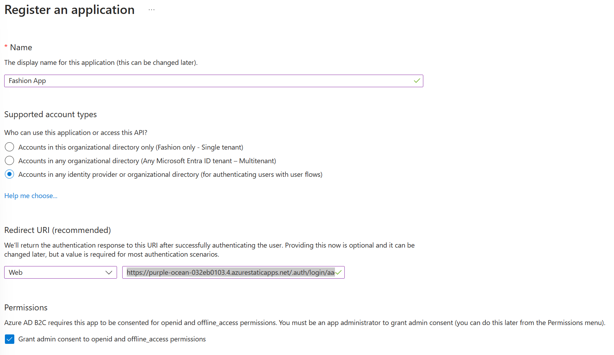

# Azure B2C

The site will use Azure B2C for authentication and to enable third party identity providers to be easily used. While there are a lot of instructions below, this is actually a fairly simple setup and considerably faster than writing your own authentication plugins.

See the following Microsoft documentation for more detailed explanations.

[Configure authentication in an Azure Static Web App by using Azure AD B2C](https://learn.microsoft.com/en-us/azure/active-directory-b2c/configure-authentication-in-azure-static-app)

[Configure Azure Static Web Apps](https://learn.microsoft.com/en-us/azure/static-web-apps/configuration)

[Set up sign-up and sign-in with a Microsoft account using Azure Active Directory B2C](https://learn.microsoft.com/en-gb/azure/active-directory-b2c/identity-provider-microsoft-account?WT.mc_id=Portal-Microsoft_AAD_B2CAdmin&pivots=b2c-user-flow)

## Create the Directory

<table>
<tr>
<td width="60%">In your resource group, click Create and search for "Azure Active Directory B2C" then select and click Create. Note that Azure AD B2C might eventually be rebranded under the Entra brand so these labels may look different in the future.</td>
<td width="40%"></td>
</tr>
<tr>
<td width="60%">Select "Create a new Azure AD B2C Tenant.".</td>
<td width="40%"></td>
</tr>
<tr>
<td width="60%">Add an organisation name, domain name, and your resource group name. Click Create</td>
<td width="40%"></td>
</tr>
<tr>
<td width="60%">In order to manage your B2C directory, you will need to switch directory in the portal. I recommend opening a second tab in your browser as switching back and forth will get tiring very quickly. Click your name then "Switch Directory" and choose the new directory once created. When asked to login, your existing administrator account should work (in simple environments). Your B2C tenant is now created.</td>
<td width="40%"></td>
</tr>
</table>

## Register with a Provider

<table>
<tr>
<td width="60%">In your B2C tenant, open the Azure AD B2C page and click "identity providers" on the side menu.</td>
<td width="40%"></td>
</tr>
<tr>
<td width="60%">You'll see that by default only email is enabled. This will allow users to create an account directly on your service. While this might be useful in some situations, for most use-cases it's better to offer for people to use their existing accounts so that they don't need to remember another password. Each provider might have a slightly different configuration procedure, but these are documented in the portal with a link once you click on the provider name. Here, we'll set up "Microsoft Account", which will allow users to login with their Live ID (formerly MSN, Hotmail, etc.)</td>
<td width="40%"></td>
</tr>
<tr>
<td width="60%">As you can see, we need to fill in a client ID and Client secret. These are generated back in your normal tenant as an app registration in Entra ID (formerly Azure AD). From this page, copy the callback URL as you will need it in the next step.</td>
<td width="40%"></td>
</tr>
<tr>
<td width="60%">Back in your regular Azure directory portal, click "All Services" on the menu and search for "App Registrations" and click on it.</td>
<td width="40%"></td>
</tr>
<tr>
<td width="60%">Click "New Registration" and give your app a name then select "Personal Microsoft accounts only". Under Redirect URI choose Web and then paste the URL you copied in the previous step. This will be "https://your-tenant-name.b2clogin.com/your-tenant-name.onmicrosoft.com/oauth2/authresp", replacing your-tenant-name in both places with the tenant name you chose. Click Register.</td>
<td width="40%"></td>
</tr>
<tr>
<td width="60%">Copy the "Application (client) ID" GUID from the screen after registration, this is what you need for the B2C registration. Click "Add a certificate or secret"</td>
<td width="40%"></td>
</tr>
<tr>
<td width="60%">Click "New Client Secret" then give a description and choose an expiry. Note that you will need to manage this secret since it expires for security reasons. Click add and copy the secret value, this will also be needed to complete the provider registration.</td>
<td width="40%"></td>
</tr>
<tr>
<td width="60%">Click on Authentication, then tick the "Access Tokens (Used for implicit flows)" box.</td>
<td width="40%"></td>
</tr>
<tr>
<td width="60%">Back in the B2C tenant, complete the form and click save to complete registration. Note that "Name" here is what your users will see on the Microsoft login button so I suggest using "Microsoft Personal Account" or similar. Many documents suggest MSA, but this will confuse your users so use something more descriptive.</td>
<td width="40%"></td>
</tr>
</table>

## Configure a user flow

<table>
<tr>
<td width="60%">In your B2C tenant, click User Flows, then New User Flow</td>
<td width="40%"></td>
</tr>
<tr>
<td width="60%">Click Sign up and sign in" to create the main user flow for logging in and registering with the app. Choose Recommended and click Create.</td>
<td width="40%"></td>
</tr>
<tr>
<td width="60%">Add a name, here I've used susi for sign in sign out. Select email signup if you want people to be able to create accounts, then select your Microsoft provider. Select MFA options, I used email and off since it's just a demo. Tick some user attributes to collect on signup, you'll use some of these in the app. Click Create.</td>
<td width="40%"></td>
</tr>
</table>

## Register your app

<table>
<tr>
<td width="60%">Next, we need to register the actual static web app to enable it to use the B2C tenant. Click "App Registrations" in the B2C interface then click new registration.</td>
<td width="40%"></td>
</tr>
<tr>
<td width="60%">Give your app a name to identify it in B2C and add a redirect URL set to web with the URI "https://<your static web app domain>/.auth/login/aadb2c/callback". Be sure to replace the domain with the one from your web app. Click Register.</td>
<td width="40%"></td>
</tr>
<tr>
<td width="60%">Copy the client ID, which we will later add to the web app. Click Add a certificate or secret.</td>
<td width="40%"></td>
</tr>
<tr>
<td width="60%">Click on Authentication, then tick the "Access Tokens (Used for implicit flows)" box.</td>
<td width="40%"></td>
</tr>
<tr>
<td width="60%">Add the secret in the same way we did in the main directory. Copy the value once created to add to the app.</td>
<td width="40%"></td>
</tr>
</table>

## Configure the Static Web App

<table>
<tr>
<td width="60%">In your main Azure tenant, open the static web app you created earlier and click on Environment Variables. Add two, and name them AADB2C_PROVIDER_CLIENT_ID and AADB2C_PROVIDER_CLIENT_SECRET. Copy in the clientID and Secret from the previous step in the B2C tenant. These will be used in the configuration file later on.</td>
<td width="40%"></td>
</tr>
</table>

Create a file in your repository called staticwebapp.config.json and paste the below text in. The top section shows which files will be protected by authentication, for now we will name them individually. I suggest not including your index.html landing page since people will need somewhere to find the site before logging in. I included two pages that need authentication here to demonstrate and you can modify or copy these. If you add a page, be aware of the commas to make the JSON correct, the last entry does not have a comma after it.

The bottom section includes the variable names we configured earlier to give access to the secrets. It also includes the URL for the authentication configuration, replace your tenant name and note that it includes the B2C_1_susi name that we configured earlier, change this if you used a different name.

```json
  {
    "routes": [
      {
        "route": "/page1.html",
        "allowedRoles": ["authenticated"]
      },
      {
        "route": "/page2.html",
        "allowedRoles": ["authenticated"]
      }
    ],
    "responseOverrides": {
      "401": {
        "statusCode": 302,
        "redirect": "/.auth/login/aadb2c"
      }
    },
    "auth": {
      "identityProviders": {
        "customOpenIdConnectProviders": {
          "aadb2c": {
            "registration": {
              "clientIdSettingName": "AADB2C_PROVIDER_CLIENT_ID",
              "clientCredential": {
                "clientSecretSettingName": "AADB2C_PROVIDER_CLIENT_SECRET"
              },
              "openIdConnectConfiguration": {
                "wellKnownOpenIdConfiguration": "https://<yourB2CTenant>.b2clogin.com/<yourB2CTenant>.onmicrosoft.com/B2C_1_susi/v2.0/.well-known/openid-configuration"
              }
            },
            "login": {
              "nameClaimType": "Email Addresses",
              "scopes": ["openid"]
            }
          }
        }
      }
    }
  }
```
For testing, I also created two files.

index.html is just a landing page. It's not authenticated but has a link to page1.html which is authenticated.

```html
<!DOCTYPE html>
<html lang="en">
  <head>
    <title>Home | Fashion</title>
  </head>
  <body>
    <a href="page1.html">page1</a>
  </body>
</html>
```

page1.html is authenticated and just says "Welcome!" to confirm you logged in.

```html
<!DOCTYPE html>
<html lang="en">
  <head>
    <title>Home | Fashion</title>
  </head>
  <body>
    Welcome!
  </body>
</html>
```

Both of these can be removed once you're comfortable that the B2C is working.