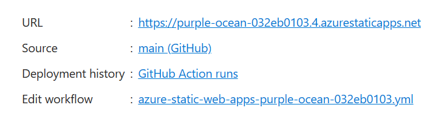

# Create Web App

Follow these instructions to create a repository and a static web app. We'll add to this later with B2C and the site code.

<table>
<tr>
<td width="60%">First, create a new resource group for the app. Here I'm using Sweden Central since it's currently a region with availability for GPT4 Vision.</td>
<td width="40%"></td>
</tr>
<tr>
<td width="60%">Next, create a git repository to house the code. This will be used to deploy your site when you commit new versions automatically.</td>
<td width="40%"></td>
</tr>
<tr>
<td width="60%">Click create and search for static web app, then select and click Create.</td>
<td width="40%"></td>
</tr>
<tr>
<td width="60%">fill in the web app details including name and plan type. Because we're using authentication you'll need to use Standard plans. Fill in your git repository details. Next click Review and Create then Create.</td>
<td width="40%"></td>
</tr>
<tr>
<td width="60%">You can now go to the resource and find the web address at the top of the page. This will be randomly generated so you may want to create a browser shortcut for testing. You can now clone your repository, create an index.html and commit to deploy to your site.</td>
<td width="40%"></td>
</tr>
</table>
Here is an example of an index.html you can use to try out the web app. You can find the full source code for the fashion app in this repository under the website directory. This includes html for the pages, css for the styling, and javascript for the dynamic parts which load things and submit data. I chose these as they are the most basic building blocks of the Internet and make for easy reading and understanding.

```html
<html>
  <head>
    <title>Fashion App</title>
  </head>
  <body>
    Hello World!
  </body>
</html>
```

