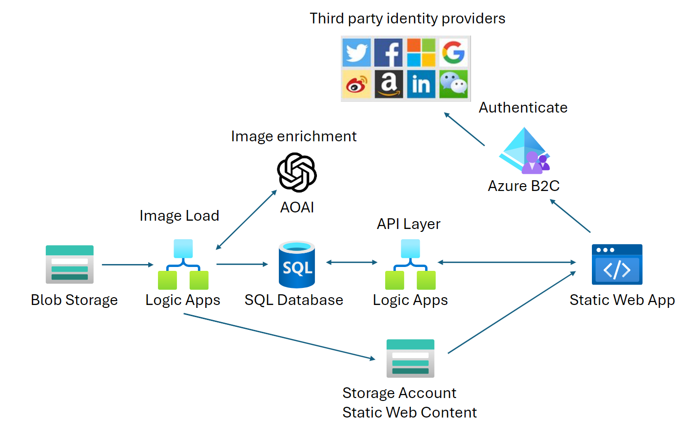

# FashionApp

**Produced by Dave Lusty**

## Introduction

An app to demo LLMs for the fashion and retail industry. This app was created as part of a hackathon and since refined. 

The hack team were: 
* Ola Taiwo
* Keith Howling
* Gary McMahon
* Valmir Meneses
* James Sibley
* Xuan Ni Leong
* Stefan Atanasiu
* Robin Davidson
* Jose Alonso
* Thom McKiernan
* Aaran Ladva
* Renata B.
* Lee Hilton-Smith
* Taonga Banda

### Product Catalog

<table>
<tr>
<td width="60%">The product catalog is automatically created by dropping images into a blob store. The images are then pushed through an LLM to get a description, and to score the garments for attributes (fun, formal, etc.) and occasions (wedding, black tie, party, etc.).</td>
<td width="40%"><a href="https://www.youtube.com/watch?v=YVrJ57StAoZg"> Video</a></td>
</tr>
</table>

### Swipe

<table>
<tr>
<td width="60%">The user can log in and swipe images to decide if they like or dislike the garment. The results are stored in the database to build up a picture of what the user will like using the attribute scores of the garment.</td>
<td width="40%"><a href="https://www.youtube.com/watch?v=FqeBDm1covM"> Video</a></td>
</tr>
</table>

## Architecture

### Product Load

In this demo, the product load is carried out by adding an image to blob storage. A Logic App is triggered by new files being added, and collects that image for processing. This logic app copies the image to a static web content blob store to ensure it's accessible from the Internet for the app. The image is then processed using the GPT4 Vision model to score it out of ten for various occasions and attributes, as well as generating a product description for the catalog. These details are then recorded into the database for use in the app.

### API Backend

The API backend for the website is created using Logic Apps. These interact with the database and blob storage using managed identity, and perform various functions:

* getChat - returns a chat response given an image and chat history text.
* getAttributes - returns a full list of all attribute names.
* getOccasions - returns a full list of occasion names.
* getProductAttributeScores - returns a list of all attribute scores for a specific product.
* getProductOccasionScores - returns a list of all occasion scores for a specific product.
* getProductByAttribute - returns a full catalog listing sorted by attribute scores (best first).
* getProductByOccasion - returns a full catalog listing sorted by occasion scores (best first).
* getRandomProduct - returns a random product listing for the swipe interface.
* getUserScores - returns the scores for a user in each attribute and occasion for like and dislike. This may change in future as the scores are currently just the mean of the scores.
* getProductInfo - returns all information and scores for a specific product.
* postUserGarmentScore - posts a like or dislike score for a user against a specific product.
* productLoader - loads products into the catalog and processes them for scores and description.

While Logic Apps are great for use in a hackathon for rapid development, Functions would deliver lower latency and improved throughput for the app and so may be a better choice for production.

### Web Frontend

The web frontend runs as an Azure Static Web App and is pure HTML, CSS and Javascript and has been written to be easy to understand. As such the code is not optimised and libraries have been avoided since this is a demo rather than a product.

There are pages for:

* catalog - shows the whole product catalog (not paged, for simplicity) sorted by either occasion or attribute.
* chat - allows a user to chat with the bot about a product in the catalog.
* index - landing page with links to the main site sections.
* pictureChat - as with chat but with the addition of a file upload button to upload pictures of outfits or garments to chat about.
* showProduct - shows all information about a specific product.
* swipe - Tinder like swipe interface to rapidly like or dislike garments.
* userScores - displays data collected for a specific user when swiping.

### Authentication

The app uses Azure B2C for authentication. This allows us to use either Entra ID for a corporate app, local passwords for a self contained app, or third party social password systems such as Google, Facebook, or even Microsoft Live ID. Authorisation is done within the static web app in a config file which details which files require authentication to access. In the app, all files except the index landing page require authorisation.

## Build Documentation

[Web App](Documentation/webapp.md)

[Database](Documentation/database.md)

[Azure B2C](Documentation/b2c.md)